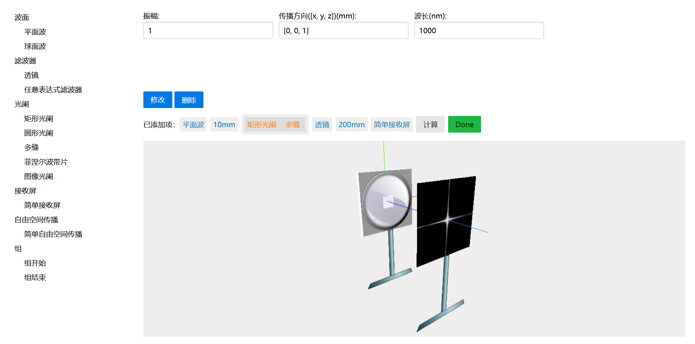

波动光学仿真软件，通过添加光学元件可以查看最后接收屏上的衍射图样。
使用`three.js`显示元件，后台服务器使用`python`计算。



安装
----

1. 安装 [`python`](www.python.org)
2. 打开命令行，依次输入以下命令，安装 [`flask`](https://palletsprojects.com/p/flask/)，[`jinja2`](https://palletsprojects.com/p/jinja/)，[`numpy`](www.numpy.org)和[`pillow`](https://github.com/python-imaging/Pillow)
```
>>> pip install flask
>>> pip install jinja2
>>> pip install numpy
>>> pip install Pillow
```
如果安装失败，可以去[这个网站](www.lfd.uci.edu/~gohlke/pythonlibs/)手动安装

3. 将本项目下载到本地并解压，在本文件夹内运行命令行，依次输入
```
>>> $env:FLASK_APP = "main.py"
>>> flask run
```
4. 打开浏览器，输入`127.0.0.1:5000`
